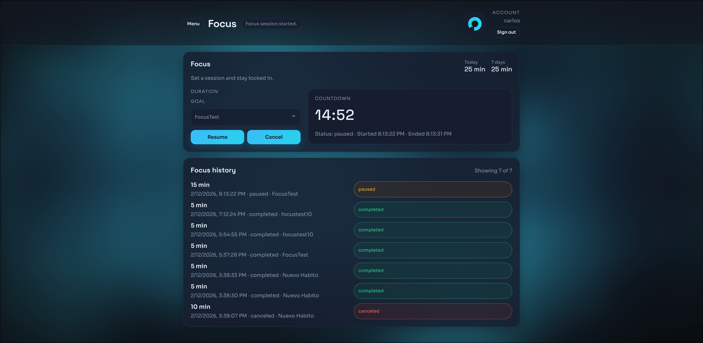
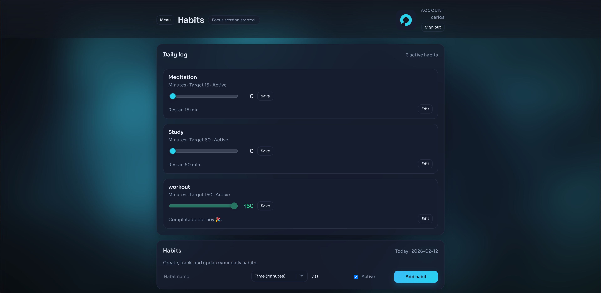
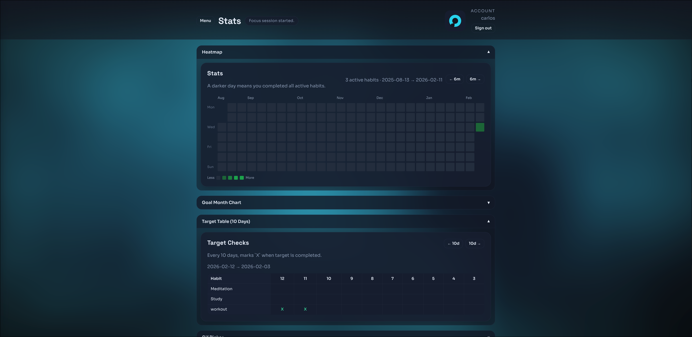

Read this in: [Español](README.es.md)

# Ethos - Focus, Habits, and Stats

Ethos is a productivity app with authentication, focus sessions, habit tracking, and progress analytics.

## Main View
  

## Core Features

- Auth with cookie session (`/auth/login`, `/auth/me`, `/auth/logout`)
- Focus timer with goal selection (time goals), pause/resume/cancel/complete
- Habit management (create, edit, delete)
- Goal types: `time`, `count`, `boolean`
- Daily manual logging with target progress
- Stats heatmap (goal completion by day)
- Goal month chart (minutes per day for a selected goal)
- Target checks table (10-day window with completion marks)
- Service worker + PWA support
- Header gif picker from `public/gifs`
- Focus-complete notification (desktop and installed PWA when permissions are granted)

## Tech Stack

- Frontend: React + TypeScript + Vite
- Backend: FastAPI + SQLAlchemy + Alembic
- Database: PostgreSQL
- Deployment/runtime: Docker Compose


## Local Development (Docker)


1. Fill required values in `.env` from `.env.example` (database + auth + CORS + secrets).

2. Build and run:

```bash
docker compose -f docker-compose.yml up -d --build
```

3. Run migrations:

```bash
docker compose -f docker-compose.yml exec api alembic upgrade head
```

## App URLs

- Web app: `http://localhost:5173`
- API: `http://localhost:8000`
- OpenAPI docs: `http://localhost:8000/docs`

## Notes

- For mobile notifications on iOS, install as PWA and allow notifications.

## More Views 

  


  

